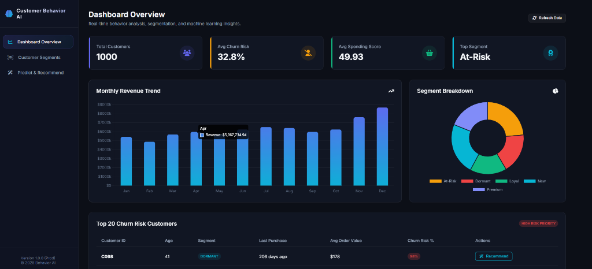
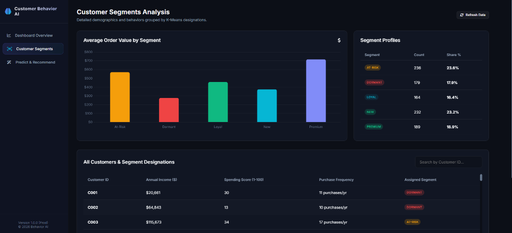
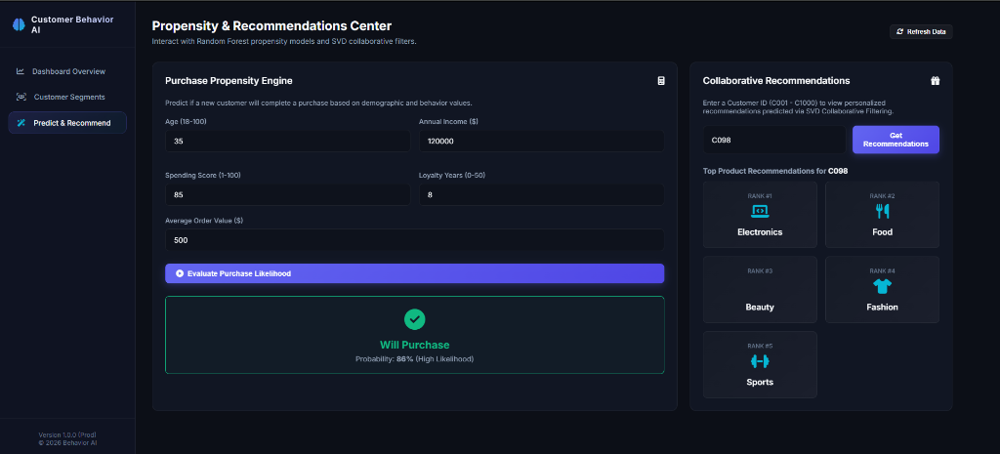

# 🧠 AI-Driven Customer Behavior Analysis


> A production-ready AI platform that analyzes customer behavior, predicts purchase intent, detects churn risk, and delivers personalized product recommendations — all served through a real-time interactive dashboard.

---

## 📌 Problem Statement

Businesses struggle to understand complex customer behavior patterns from vast datasets, leading to suboptimal marketing strategies and poor customer experience. Traditional analytics provide only **static reports**, lacking dynamic insights and predictive capabilities.

This platform solves that by leveraging **statistical analysis**, **machine learning**, and **advanced visualization** to:

- 🔍 Uncover hidden customer segments
- 🛒 Predict purchasing behavior
- 🚨 Detect churn risk early
- 🎯 Personalize product recommendations
- 📈 Enhance engagement and drive revenue growth

---

## 🖥️ Live Dashboard

| Page                       | Features                                                                        |
+| -------------------------- | ------------------------------------------------------------------------------- |
| 📊 **Dashboard Overview**  | KPI cards, monthly revenue trend, segment breakdown, top 20 churn risk table    |
| 👥 **Customer Segments**   | K-Means cluster analysis, avg order value by segment, searchable customer table |
| 🎯 **Predict & Recommend** | Purchase likelihood engine, SVD collaborative filtering recommendations         |

---

## ✨ Features

- ✅ **Synthetic Data Engine** — 1,000 realistic customer records with correlated behavioral features
- ✅ **Customer Segmentation** — K-Means (K=5): Premium, Loyal, New, At-Risk, Dormant
- ✅ **Purchase Prediction** — Random Forest Classifier tuned with GridSearchCV
- ✅ **Churn Prediction** — XGBoost + SMOTE for class imbalance handling
- ✅ **Product Recommendations** — SVD Collaborative Filtering (scikit-surprise)
- ✅ **REST API** — Flask with Blueprints, CORS, global JSON error handling
- ✅ **SQLite Database** — Stores segments, churn scores, and customer features
- ✅ **Interactive Dashboard** — Dark glassmorphic UI with Chart.js visualizations

---

## 🗂️ Project Structure

```
AI-Driven-Customer-Behavior-Analysis/
│
├── 📁 data/
│   ├── raw/
│   │   └── customers.csv               # Raw synthetic customer dataset (1000 rows)
│   └── processed/
│       └── cleaned_data.csv            # Preprocessed and feature-engineered data
│
├── 📁 ml/
│   ├── __init__.py
│   ├── data_generation.py              # Generates realistic synthetic customer data
│   ├── data_preprocessing.py           # IQR outlier removal, scaling, encoding
│   ├── segmentation.py                 # K-Means clustering with elbow method
│   ├── purchase_prediction.py          # Random Forest + GridSearchCV
│   ├── churn_prediction.py             # XGBoost + SMOTE class balancing
│   ├── recommendation.py               # SVD Collaborative Filtering
│   └── model_trainer.py                # Single script to train all 4 models
│
├── 📁 models/
│   ├── categorical_encoders.pkl        # Saved label/one-hot encoders
│   ├── segmentation_model.pkl          # Trained K-Means model
│   ├── purchase_model.pkl              # Trained Random Forest model
│   ├── churn_model.pkl                 # Trained XGBoost model
│   └── recommendation_model.pkl        # Trained SVD model
│
├── 📁 api/
│   ├── __init__.py
│   ├── app.py                          # Flask app, CORS, model loader on startup
│   ├── routes/
│   │   ├── __init__.py
│   │   ├── segments.py                 # /api/segments endpoints
│   │   ├── predictions.py              # /api/predict endpoints
│   │   ├── churn.py                    # /api/churn-risk endpoints
│   │   └── recommendations.py          # /api/recommend endpoints
│   └── utils/
│       ├── __init__.py
│       └── helpers.py                  # Shared utility functions
│
├── 📁 frontend/
│   ├── index.html                      # Single-page dark theme dashboard
│   ├── css/
│   │   └── style.css                   # Glassmorphic dark UI styles
│   └── js/
│       └── dashboard.js                # Chart.js + Fetch API integration
│
├── 📁 tests/
│   ├── test_ml.py                      # Unit tests for ML model pipelines
│   └── test_api.py                     # Unit tests for API endpoints
│
├── config.py                           # App config, model paths, DB settings
├── run.py                              # Unified entry point — runs everything
├── requirements.txt                    # All Python dependencies with versions
└── README.md                           # Project documentation
```

---

## 🛠️ Tech Stack

| Category      | Technology                                            |
| ------------- | ----------------------------------------------------- |
| **Language**  | Python 3.10+                                          |
| **ML & Data** | Scikit-learn, XGBoost, Scikit-surprise, Pandas, NumPy |
| **Balancing** | Imbalanced-learn (SMOTE)                              |
| **Backend**   | Flask 2.3.3, Flask-CORS                               |
| **Database**  | SQLite3                                               |
| **Frontend**  | HTML5, CSS3, Vanilla JavaScript                       |
| **Charts**    | Chart.js                                              |
| **Icons**     | Font Awesome                                          |
| **Fonts**     | Google Fonts — Inter                                  |

---

## ⚙️ Installation & Setup

### 1️⃣ Clone the repository
```bash
git clone https://github.com/yourusername/AI-Driven-Customer-Behavior-Analysis.git
cd AI-Driven-Customer-Behavior-Analysis
```

### 2️⃣ Create and activate virtual environment

**Windows:**
```powershell
python -m venv .venv
.\.venv\Scripts\Activate.ps1
```

**Mac / Linux:**
```bash
python -m venv .venv
source .venv/bin/activate
```

### 3️⃣ Install all dependencies
```bash
pip install -r requirements.txt
```

---

## 🚀 Running the Application

```bash
python run.py
```

The `run.py` script will automatically:
1. 📊 Generate synthetic customer dataset if missing
2. 🤖 Train all 4 ML models if not already saved
3. 🗄️ Initialize SQLite database
4. 🌐 Start the Flask development server

Then open your browser at:
```
http://127.0.0.1:5000
```

---

## 📡 API Documentation

| Method | Endpoint                | Description                                |
| ------ | ----------------------- | ------------------------------------------ |
| `GET`  | `/api/health`           | Health check — model and database status   |
| `GET`  | `/api/segments`         | All customer segment classifications       |
| `GET`  | `/api/segments/<id>`    | Segment label for a specific customer      |
| `POST` | `/api/predict/purchase` | Purchase likelihood with probability score |
| `GET`  | `/api/churn-risk`       | Top 20 highest churn risk customers        |
| `GET`  | `/api/churn-risk/<id>`  | Churn score for a specific customer        |
| `GET`  | `/api/recommend/<id>`   | Top 5 product recommendations              |
| `GET`  | `/api/dashboard/stats`  | Aggregated KPIs and stats for dashboard    |

### 📥 Purchase Prediction — Request
```json
POST /api/predict/purchase
{
  "age": 35,
  "annual_income": 120000,
  "spending_score": 85,
  "loyalty_years": 8,
  "average_order_value": 500.0
}
```

### 📤 Purchase Prediction — Response
```json
{
  "status": "success",
  "data": {
    "will_purchase": 1,
    "purchase_probability": 0.92,
    "confidence_label": "High Likelihood"
  }
}
```

### 📤 Product Recommendations — Response
```json
{
  "status": "success",
  "data": {
    "customer_id": "C001",
    "recommendations": ["Fashion", "Electronics", "Beauty", "Sports", "Food"]
  }
}
```

---

## 🤖 ML Models Summary

| Model                   | Algorithm                    | Target              | Metric                        |
| ----------------------- | ---------------------------- | ------------------- | ----------------------------- |
| **Segmentation**        | K-Means (K=5)                | Customer clusters   | Elbow curve, Centroid profiles|
| **Purchase Prediction** | Random Forest + GridSearchCV | Will purchase (0/1) | Accuracy, F1-score            |
| **Churn Prediction**    | XGBoost + SMOTE              | Churn label (0/1)   | ROC-AUC, Confusion matrix     |
| **Recommendation**      | SVD Collaborative Filtering  | Product category    | Rating estimation             |

---

## 👥 Customer Segments Explained

| Segment        | Behavior                  | Business Strategy             |
| -------------- | ------------------------- | ----------------------------- |
| 🟣 **Premium** | High income, high spend   | VIP rewards, exclusive offers |
| 🟢 **Loyal**   | Regular consistent buyers | Loyalty points, early access  |
| 🟠 **At-Risk** | Was active, now declining | Urgent retention campaigns    |
| 🩵 **New**     | Recently joined           | Welcome offers, onboarding    |
| 🔴 **Dormant** | Long inactive             | Re-engagement emails          |

---

## 📊 Model Training & Performance Outputs

Below are the actual performance metrics and training logs generated from running the model training pipeline (`python -m ml.model_trainer`):

### 1. Customer Segmentation (K-Means Clustering)
- **Features**: `annual_income`, `spending_score`, `purchase_frequency`
- **Resulting Segment Centroids (Profiles)**:
  - 🟣 **Premium**: Income ≈ $119,338, Spending Score ≈ 79.91, Purchase Frequency ≈ 36.34/yr
  - 🟢 **Loyal**: Income ≈ $52,776, Spending Score ≈ 82.70, Purchase Frequency ≈ 37.43/yr
  - 🩵 **New**: Income ≈ $56,181, Spending Score ≈ 49.92, Purchase Frequency ≈ 23.55/yr
  - 🟠 **At-Risk**: Income ≈ $121,085, Spending Score ≈ 28.93, Purchase Frequency ≈ 15.11/yr
  - 🔴 **Dormant**: Income ≈ $56,602, Spending Score ≈ 15.92, Purchase Frequency ≈ 9.32/yr

### 2. Purchase Propensity Model (Random Forest)
- **Features**: `age`, `annual_income`, `spending_score`, `loyalty_years`, `average_order_value`
- **Tuned Hyperparameters**: `{'max_depth': 5, 'min_samples_split': 5, 'n_estimators': 50}`
- **Classification Performance**:
  - Accuracy: **86%**
  - F1-Score: **0.87**
  - Details:
    ```text
                  precision    recall  f1-score   support

               0       0.88      0.85      0.86       101
               1       0.85      0.88      0.87        99

        accuracy                           0.86       200
       macro avg       0.87      0.87      0.86       200
    weighted avg       0.87      0.86      0.86       200
    ```

### 3. Churn Prediction Model (XGBoost + SMOTE)
- **Features**: All numerical customer behavior features (9 columns)
- **Imbalance Handling**: SMOTE applied (original train count `[562, 238]`, balanced to `[562, 562]`)
- **Metrics**:
  - ROC-AUC Score: **0.8012**
  - Confusion Matrix:
    ```text
    [[109  31]
     [ 22  38]]
    ```
  - Details:
    ```text
                  precision    recall  f1-score   support

               0       0.83      0.78      0.80       140
               1       0.55      0.63      0.59        60

        accuracy                           0.73       200
       macro avg       0.69      0.71      0.70       200
    weighted avg       0.75      0.73      0.74       200
    ```

### 4. Collaborative Product Recommendation (SVD)
- **Algorithm**: SVD Collaborative Filtering fitted using ratings database (`customer_id`, `product_category`, `customer_rating`).
- **Sample Recommendation Output (Customer C001)**:
  `['Fashion', 'Food', 'Beauty', 'Electronics', 'Sports']`

---

## 🧪 Running Tests

To execute the unit tests verifying model pipelines and API endpoints:
```bash
python -m unittest discover -s tests
```

---

## 📸 Dashboard Screenshots

### 📊 Dashboard Overview


### 👥 Customer Segments Analysis


### 🎯 Propensity & Recommendations Center


---

## 📦 Requirements

```
flask==2.3.3
flask-cors==4.0.0
pandas==2.0.3
numpy==1.24.3
scikit-learn==1.3.0
xgboost==1.7.6
imbalanced-learn==0.11.0
scikit-surprise==1.1.5
matplotlib==3.7.2
seaborn==0.12.2
joblib==1.5.3
python-dotenv==1.0.0
```

---

## 📄 License
MIT License
